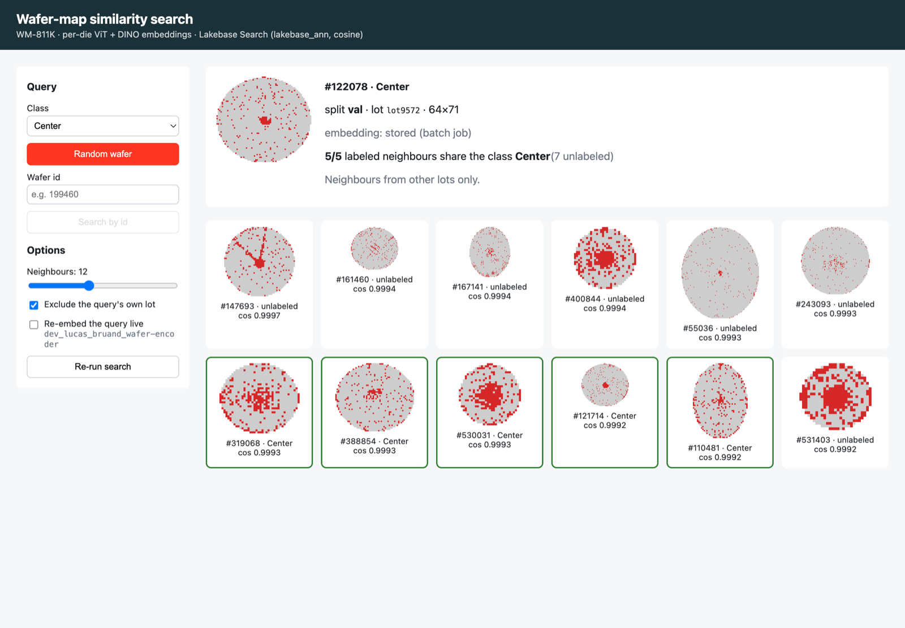
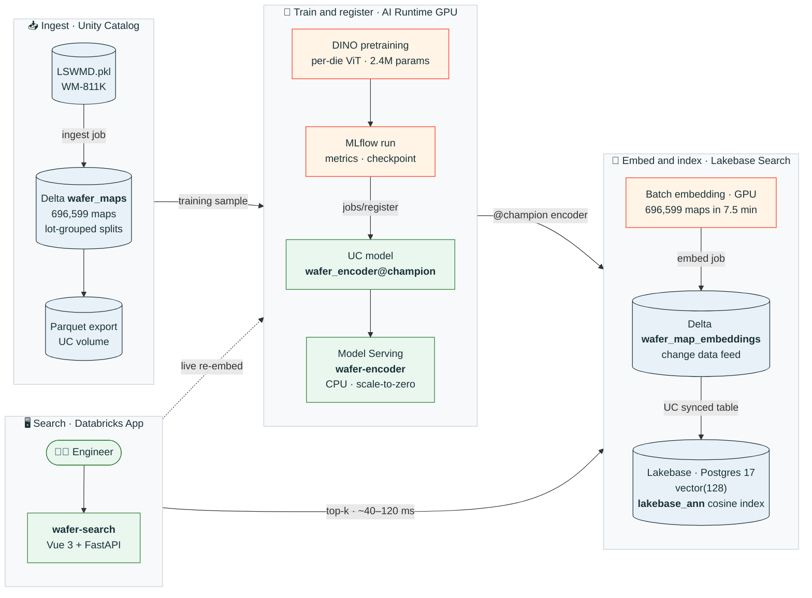

# wafer-embeddings

[](https://github.com/lbruand-db/wafer-embeddings/actions/workflows/ci.yml)
[](https://github.com/astral-sh/uv)
[](https://github.com/psf/black)
[](https://github.com/astral-sh/ty)
[](pyproject.toml)
[](databricks.yml)
[](SPEC/SPECS.md#11-databricks-implementation-stack)
[](SPEC/SPECS.md#9-lakebase-search-integration)
[](app/)

A reusable Databricks template for **self-supervised embeddings of semiconductor wafer
maps**: a per-die Vision Transformer trained with DINO on Databricks AI Runtime
(serverless GPU), registered in Unity Catalog, served on Model Serving, indexed in
**Lakebase Search**, and searchable from a **Databricks App**. Primary dataset:
[WM-811K](http://mirlab.org/dataSet/public/MIR-WM811K.zip) (811,457 maps, 696,599 after
dedup; variable die-grid sizes; 9 defect classes on the ~24% labeled subset; labels are
used **only for evaluation**). Design: [`SPEC/SPECS.md`](SPEC/SPECS.md). Plan and current
status: [`SPEC/PLAN.md`](SPEC/PLAN.md).



*The `wafer-search` app: a Center-defect query and its 12 nearest neighbours from **other
lots** (the `lakebase_ann` cosine index over 696,599 embeddings). The 5 labeled
neighbours are all Center (green borders); the unlabeled ones show the same centre blob.*

## What's built, end to end



| Piece | Where | Status |
|---|---|---|
| Ingest (stream, dedup, **lot-grouped** splits) | `jobs/ingest.py`, bundle job `ingest` | ✅ 696,599 maps, 45,345 lots |
| DINO pretraining (reference-faithful recipe) | `train/`, `ai_runtime/train.yaml` | ✅ on `GPU_1xA10` |
| UC model (MLflow pyfunc) | `serving/`, `jobs/register.py` | ✅ `wafer_encoder` v2 `@champion` |
| Real-time serving | `jobs/serve.py` (serves `@champion`) | ✅ CPU Small, scale-to-zero |
| Batch embeddings | `ai_runtime/embed.yaml` + bundle job `embed` | ✅ 696,599 maps in 7.5 min (A10) |
| Lakebase Search (project, Search, DB, extension, synced table, index, grants) | `jobs/lakebase.py`, bundle job `bootstrap` | ✅ fully automatic + idempotent |
| Search app | `app/` (Vue 3 + FastAPI), `resources/app.yml` | ✅ top-k in ~40–120 ms |

## Why per-die tokens

Wafer maps vary wildly in size (a handful of dies up to tens of thousands) and every die
matters, so instead of resizing to a fixed image we treat **each on-wafer die as one
token** (patch=1). The encoder is a Set Transformer over dies: center/radius-normalized
coordinates with Fourier features (generalize to unseen grid sizes), a learned per-die
state embedding, permutation/padding-invariant attention, **ISAB** induced attention
(O(N·m)) and a **defect-preserving token cap** (keep every FAIL die, subsample PASS dies)
for WM-811K's giant maps. Training is **DINO** self-distillation following the reference
recipe: 2 global + 6 local crops, pre-LN blocks, cosine weight decay 0.04 → 0.4, the
`5e-4·batch/256` LR rule, EMA teacher, prototype-layer freeze.

## Results so far

Evaluation is **exact search** over the embeddings, with the protocol in
[SPECS §8.7](SPEC/SPECS.md#87-protocol): splits by **lot** (a whole lot lands in one split),
development on **val**, **test scored once**, no labels anywhere in training. Because one
device spans many lots, the headline metrics are **cross-device**: a query may not use
neighbours with its own map shape. Every run also scores the untrained encoder and a
training-free, rotation-invariant **polar FAIL-density** descriptor (`eval/baselines.py`).

Current model (`wafer_encoder` v2, width 128, depth 6, 10k steps), **test split, scored once**:

| | cross-device kNN macro recall | cross-device precision@10 | map@10 | NMI |
|---|---|---|---|---|
| untrained encoder | 0.287 | 0.267 | 0.292 | 0.238 |
| **DINO (served model)** | **0.389** | **0.356** | **0.346** | 0.235 |
| polar descriptor (no training) | 0.442 | 0.359 | 0.315 | 0.296 |

The trained model clearly beats its untrained start and beats polar on map@10, but not yet
on cross-device recall. It is gated **provisionally** (G1) to prove the end-to-end stack;
see [PLAN.md](SPEC/PLAN.md) for what was learned (leaky per-map splits, the DINO recipe
deviations that mattered, levers that didn't) and the next modelling steps.

## Layout

```
databricks.yml            # Databricks Asset Bundle (target dev -> fevm-mmf-mlops-demo)
resources/                # bootstrap (UC + Lakebase), ingest, embed jobs; serving endpoint; app
ai_runtime/               # AI Runtime GPU workloads: train.yaml, embed.yaml (databricks air)
src/wafer_embeddings/
  data/                   # WM-811K parsing, dedup, lot-grouped splits
  tokenize/               # per-die tokenizer, defect-preserving token cap, augmentations
  model/                  # per-die ViT (ISAB, pre-LN), DINO head / loss / EMA teacher
  train/                  # DINO loop (multi-crop, WD/LR schedules, tracking), G1 metrics
  eval/                   # exact search, clustering, RankMe, polar baseline
  serving/                # WaferEncoder (checkpoint -> embeddings), MLflow pyfunc, map codec
  jobs/                   # bootstrap, ingest, train, register, embed, lakebase
app/                      # Databricks App: Vue 3 frontend (frontend/) + FastAPI (server.py)
tests/                    # unit tests: CPU-only, no Databricks
SPEC/                     # SPECS.md (design) + PLAN.md (risk-first plan, status)
```

## Local dev

```bash
uv sync                          # .venv with deps (+ dev: black, ty, pytest, fastapi)
uv run black --check .           # formatting (line length 100)
uv run ty check                  # type checking (Astral ty)
uv run pytest                    # 180+ Python unit tests, CPU-only, a few seconds
node --test app/frontend/src/*.test.js  # JS tests for the app's map codec
databricks bundle validate --profile mmf

# the app locally (after `cd app && npm install`)
cd app && npm run build && python server.py   # needs PGHOST + LAKEBASE_ENDPOINT + workspace auth
```

CI (`.github/workflows/ci.yml`) runs black, ty, pytest and the JS tests on every push.

## Databricks pipeline

Everything is created from code, idempotently (SPECS §11.8 / N7); re-running any step
is safe.

```bash
databricks bundle deploy --profile mmf          # jobs, serving endpoint, app

# 1. UC schema + volume, Lakebase project + Lakebase Search + database + lakebase_vector
databricks bundle run bootstrap --profile mmf

# 2. Ingest WM-811K -> Delta wafer_maps + parquet export (lot-grouped splits)
databricks bundle run ingest --profile mmf

# 3. DINO pretraining on serverless GPU (defaults = the R1 recipe; overrides via the YAML)
databricks air run --file ai_runtime/train.yaml --profile mmf

# 4. Register the trained encoder in UC (sets @champion)
uv run --extra jobs python -m wafer_embeddings.jobs.register \
  --catalog mmf_mlops_demo_catalog --schema wafer_embeddings --run-id <mlflow-run-id>

# 5. Batch-embed all maps on GPU, then load into Delta + sync into Lakebase (--refresh)
databricks air run --file ai_runtime/embed.yaml --profile mmf
databricks bundle run embed --profile mmf

# 6. Start the search app
databricks bundle run wafer_search --profile mmf
```

Lakebase Search is enabled with `POST /api/2.0/postgres/projects/{project}/search-extensions`
(the call behind the UI button). The extension is `lakebase_vector` (its `CASCADE` brings the
`vector` type; pgvector is never used directly), and all similarity search goes through the
cosine `lakebase_ann` index. The bootstrap fails unless a top-k query plan uses that index.

Target workspace: `fevm-mmf-mlops-demo.cloud.databricks.com` · catalog
`mmf_mlops_demo_catalog` · schema `wafer_embeddings` · Lakebase project `wafer-embeddings`.

## Known gaps

Open work is tracked in [`SPEC/GAPS.md`](SPEC/GAPS.md). The headline items: beat the polar baseline
for a real Gate G1 (the served model is provisional), measure Lakebase ANN recall and p99
latency (Gate G2), make registration a job inside one orchestrated workflow, and make the
working training recipe the default.
